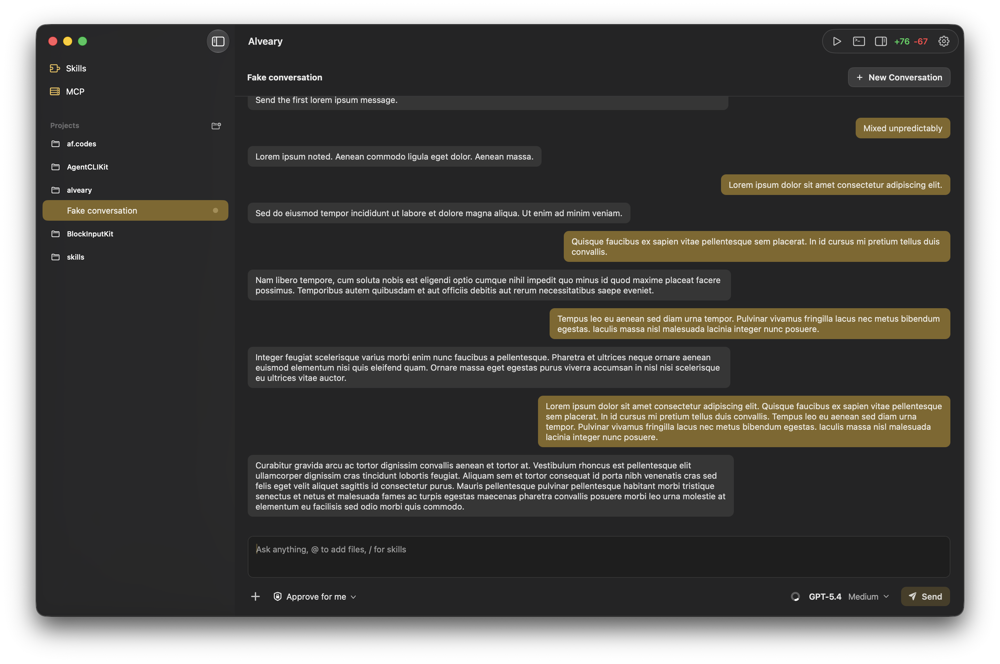

# Alveary

_An alveary is a place where bees are kept, including a beehive or apiary enclosure._

Alveary is a native macOS app for orchestrating AI coding agents. It's inspired by other apps like OpenAI's Codex.



## Download

Download the latest release from [GitHub Releases](https://github.com/afollestad/alveary/releases/latest). Releases are direct-download ZIPs named `Alveary.app.zip` and contain a signed, notarized `Alveary.app`.

After downloading:

1. Unzip `Alveary.app.zip`.
2. Move `Alveary.app` to `/Applications`.
3. Launch Alveary and follow the onboarding checks.

## Roadmap

The public backlog and roadmap are tracked in the [Alveary project board](https://github.com/users/afollestad/projects/3).

## Development

Alveary is built with XcodeGen, `xcsift`, SwiftLint, Needle, AgentCLIKit, FluidAudio, and SwiftTerm. AgentCLIKit owns provider processes and resumable sessions; Alveary owns provider-neutral scheduled-task persistence, execution, and recovery. Alveary's app-scoped conversation controllers share each conversation's subscription and persistence path across visible and background work. FluidAudio provides English speech recognition for on-device voice input on Apple silicon. The embedded terminal runs local PTYs, and project actions are injected into the user's interactive zsh so their real prompt and startup environment apply. The app target intentionally remains unsandboxed while keeping hardened runtime enabled. Run setup once per clone:

```sh
./scripts/setup.sh
```

Generate the Xcode project after project-structure changes:

```sh
xcodegen generate
```

To build, lint, or run the app:

```sh
# Build the app
./scripts/build.sh

# Lint the source
./scripts/lint.sh

 # Run the app without building
./scripts/run.sh

# Build and run the app
./scripts/run.sh -b

# Run the whole test suite
./scripts/test.sh

# Run a focused test class
./scripts/test.sh AlvearyTests/AppDelegateTests
```

Release workflow details live in [RELEASING.md](RELEASING.md).

## Voice Input

Voice input records from the system-default microphone and transcribes English speech on device. Microphone audio and recognition output are not stored separately or sent to remote servers; committed dictation becomes ordinary composer text and follows the existing draft/message lifecycle. The first use opens a blocking setup modal and downloads the approximately 600 MB Parakeet Unified model from Hugging Face, then caches validated model files by revision under `~/Library/Application Support/com.afollestad.alveary/VoiceInput/Models/`; the cache is excluded from backups. Installation, app-managed update, repair, newly requested microphone permission, and cache failures use the blocking modal and consume the initiating activation. Once a modal preparation finishes, its progress indicator becomes a green checkmark; Continue closes it, and dictation requires a fresh microphone activation.

After relaunch, an authorized microphone and validated pinned cache use a modal-free local warmup: only the microphone spinner is shown while Core ML loads, then a still-valid mouse, keyboard, or accessibility activation starts dictation automatically. An ordinary release during warmup starts latched dictation, while safety-driven invalidation or navigating away cancels the pending activation and cache-only warmup. Cache provenance is the authority for this distinction; Alveary does not persist a separate setup-completed flag. Runtime dictation requires Apple silicon, while Alveary remains a universal app.

Alveary pins FluidAudio exactly and downloads the model from the exact Hugging Face revision in `VoiceInputModelDescriptor.json`. There is no periodic or manual model-update check: changing the app-managed model pin requires a new Alveary release, and that release stages and validates the new revision before removing an older one. Repairs always download the revision pinned by the installed Alveary build. Model files are distributed separately on demand under the model's CC-BY-4.0 license, and the app bundles the required dependency and model attribution.

Maintainers regenerate the sorted descriptor and its verification digest with an explicit 40-character revision; the script never selects `main`:

```sh
./scripts/update-voice-model-descriptor.py --revision <hugging-face-commit>
```

Debug builds expose **Developer → Clear Voice Model Cache**. The command refuses to race active dictation or model preparation, unloads inference first, and then removes validated and resumable model data.

## License

Alveary is licensed under the [GNU General Public License v3.0](LICENSE.md).
