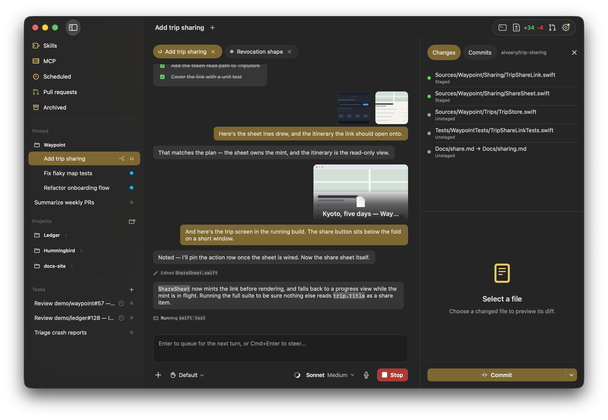

# Alveary

_An alveary is a place where bees are kept, including a beehive or apiary enclosure._

Alveary is a native macOS app for orchestrating AI coding agents. It's inspired by other apps like OpenAI's Codex.



## Download

Download the latest release from [GitHub Releases](https://github.com/afollestad/alveary/releases/latest). Releases are direct-download ZIPs named `Alveary.app.zip` and contain a signed, notarized `Alveary.app`.

After downloading:

1. Unzip `Alveary.app.zip`.
2. Move `Alveary.app` to `/Applications`.
3. Launch Alveary and follow the onboarding checks.

## Roadmap

The public backlog and roadmap are tracked in the [Alveary project board](https://github.com/users/afollestad/projects/3).

## Development

Alveary is built with XcodeGen, `xcsift`, SwiftLint, Needle, AgentCLIKit, FluidAudio, and SwiftTerm. AgentCLIKit owns provider processes and resumable sessions; Alveary owns provider-neutral scheduled-task persistence, execution, and recovery. Alveary's app-scoped conversation controllers share each conversation's subscription and persistence path across visible and background work. FluidAudio provides English speech recognition for on-device voice input on Apple silicon. Primer Octicons supplies the pull-request status glyphs. The embedded terminal runs local PTYs, and project actions are injected into the user's interactive zsh so their real prompt and startup environment apply. The app target intentionally remains unsandboxed while keeping hardened runtime enabled. Run setup once per clone:

```sh
./scripts/setup.sh
```

Generate the Xcode project after project-structure changes:

```sh
xcodegen generate
```

To build, lint, or run the app:

```sh
# Build the app
./scripts/build.sh

# Lint the source
./scripts/lint.sh

 # Run the app without building
./scripts/run.sh

# Build and run the app
./scripts/run.sh -b

# Run in demo mode: a DEBUG-only isolated profile, wiped and reseeded with fake
# data each launch, for screenshots
./scripts/run.sh --demo

# Run the whole test suite
./scripts/test.sh

# Run a focused test class
./scripts/test.sh AlvearyTests/AppDelegateTests
```

Release workflow details live in [RELEASING.md](RELEASING.md).

## Menu Bar

Alveary keeps a system menu bar item with your five most recent threads plus New Thread, Open Alveary, Settings, and Quit. Because that item is a way back into the app, closing the main window no longer quits Alveary: agent runs, scheduled tasks, and the app-shot shortcut keep going, and clicking the Dock icon or **Open Alveary** brings the window back. Turn the item off in **Settings → Menu bar**; the Dock icon remains either way.

The same tab has **Launch at startup**, which registers Alveary as a macOS login item. macOS owns that registration, so the switch reflects System Settings → General → Login Items rather than a saved preference, and it tells you when the item is switched off there.

## Pull Request Reviews

Large pull-request reviews automatically fall back to a temporary bare Git repository when GitHub refuses the full diff. Alveary uses your existing GitHub CLI sign-in, then serves the complete textual diff in resumable pages. Preparation may take several minutes; review tasks do not need a project checkout.

## GitHub Attachments

Comment and review attachments use GitHub CLI 2.99.0 or newer with repository write access. Supported images and videos upload using your existing GitHub CLI sign-in. See [attachment implementation and troubleshooting](docs/github-attachments.md) for formats, limits, and repair guidance.

## Voice Input

Voice input records from the system-default microphone and transcribes English speech on device. Microphone audio and recognition output are not stored separately or sent to remote servers; committed dictation becomes ordinary composer text. Dictation requires Apple silicon, while Alveary remains a universal app.

The first use opens a blocking setup modal that downloads the approximately 600 MB Parakeet Unified model from Hugging Face and caches validated model files by revision under `~/Library/Application Support/com.afollestad.alveary/VoiceInput/Models/`, excluded from backups. Later launches skip the modal when the microphone is authorized and the cached model is still valid: warmup happens in place, and a still-valid activation starts dictation automatically.

Alveary pins FluidAudio exactly and downloads the model from the exact Hugging Face revision in `VoiceInputModelDescriptor.json`. There is no periodic or manual model-update check; changing the pin requires a new Alveary release. Model files are distributed separately on demand under the model's CC-BY-4.0 license, and the app bundles the required dependency and model attribution.

Maintainers regenerate the sorted descriptor and its verification digest with an explicit 40-character revision; the script never selects `main`:

```sh
./scripts/update-voice-model-descriptor.py --revision <hugging-face-commit>
```

Debug builds expose **Developer → Clear Voice Model Cache**, which refuses while dictation or model preparation is active and otherwise removes validated and resumable model data.

## License

Alveary is licensed under the [GNU General Public License v3.0](LICENSE.md).
